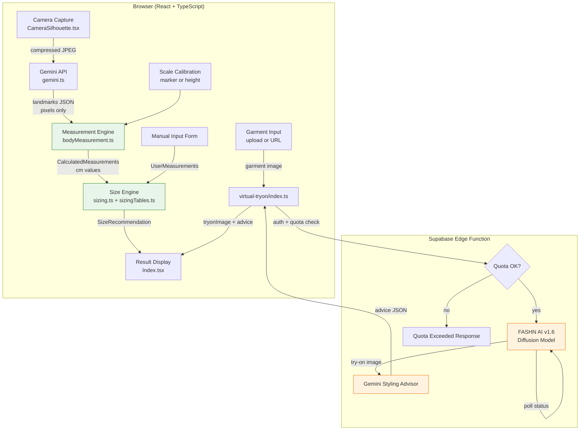
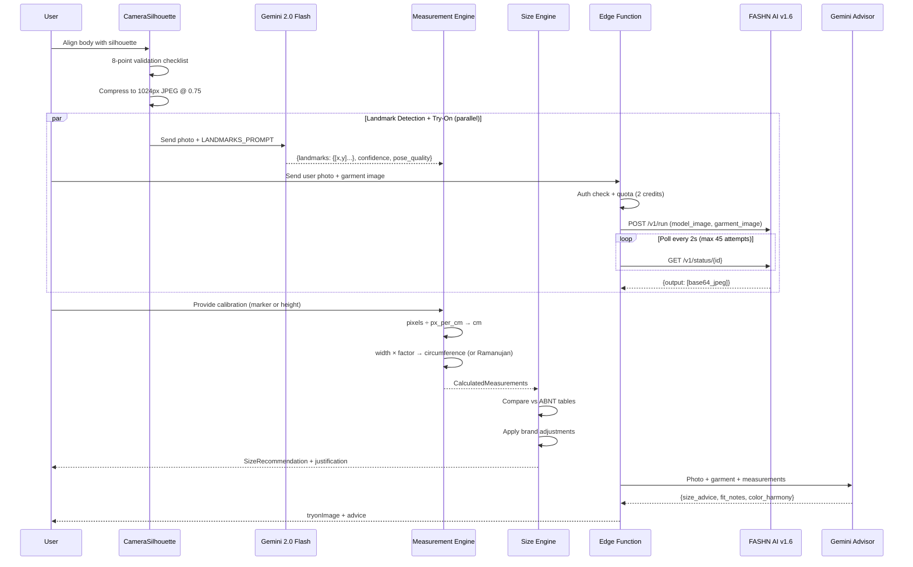

# Design Document: Virtual Try-On & Sizing Pipeline

## Overview

This document describes the technical design for provAI's end-to-end virtual try-on and sizing pipeline. The pipeline transforms a user photo into a complete fashion consultation: body measurements, deterministic size recommendation, virtual try-on image, and styling advice.

The system is split into two fundamentally different computation models:

1. **Deterministic math pipeline** (client-side TypeScript): Photo → Gemini landmarks (pixels) → calibration → centimeter measurements → ABNT size recommendation. This path is fully reproducible, auditable, and contains zero randomness.
2. **Generative AI pipeline** (server-side): User photo + garment image → FASHN AI diffusion model → try-on image; Gemini → styling advice. This path is non-deterministic by nature and treated as complementary.

The key architectural decision is that **sizing never depends on AI judgment**. Gemini's only role is detecting pixel coordinates of body landmarks — all math from pixels to sizes is local TypeScript. This makes the sizing result explainable ("Busto 92cm → M because 88-94cm range") and reproducible.

### Design Rationale

- **Separation of AI and math**: Gemini detects landmarks (pixels only), the Measurement_Engine converts to cm, the Size_Engine maps to sizes. No AI step estimates sizes directly.
- **Two calibration paths**: Physical marker (high accuracy) and declared height (good accuracy) ensure the pipeline works in all scenarios.
- **Manual override**: Consultants can enter measurements directly, bypassing photo capture entirely while using the same deterministic sizing logic.
- **Non-blocking styling**: If Gemini styling advice fails, the core result (try-on image + size) still displays. Styling is additive, never gating.
- **Edge function isolation**: The FASHN AI integration runs in a Supabase Edge Function with auth and quota enforcement, keeping API keys server-side.

## Architecture

### System Architecture Diagram



### Data Flow: Photo to Result



## Components and Interfaces

### 1. CameraSilhouette (Capture Guide)

**File**: `src/components/CameraSilhouette.tsx`

**Responsibility**: SVG overlay guiding the user into correct pose for landmark detection. Supports `front` and `side` variants.

**Interface**:
```typescript
type CameraSilhouetteProps = {
  variant: "front" | "side";
  className?: string;
};
```

**Validation Checklist** (8 points, evaluated in real-time):
1. Head visible within frame
2. Shoulders aligned horizontally
3. Full body in frame (head to feet)
4. Arms slightly away from torso (~15°)
5. Adequate lighting (no harsh shadows)
6. Stable pose (minimal motion blur)
7. No obstructing loose clothing
8. Feet visible at bottom of frame

The capture button is enabled only when all 8 points pass.

### 2. Gemini Client (Landmark Detector)

**File**: `src/lib/gemini.ts`

**Responsibility**: Direct browser-to-Gemini API client. Compresses images before sending, handles error mapping.

**Interface**:
```typescript
// Input: ChatMessage[] with image parts
// Output: raw text (JSON string to be parsed by caller)
export async function callGemini(
  model: string,
  messages: ChatMessage[],
  options?: { jsonMode?: boolean }
): Promise<string>;
```

**Landmark Request Contract**:
- Model: `gemini-2.0-flash`
- Prompt: `LANDMARKS_PROMPT` from bodyMeasurement.ts
- Input: Compressed photo (max 1024px width, JPEG 0.75 quality)
- Response format: JSON mode enabled

**Landmark Response Contract**:
```typescript
type LandmarkResponse = {
  image_width_px: number;
  image_height_px: number;
  landmarks: BodyLandmarks;  // 14 mandatory + 2 optional [x,y] pairs
  confidence: number;        // 0–1
  pose_quality: "boa" | "aceitavel" | "ruim";
  issues: string[];          // e.g., ["braços colados ao corpo", "roupa larga"]
};
```

### 3. Measurement Engine

**File**: `src/lib/bodyMeasurement.ts`

**Responsibility**: Pure deterministic math converting pixel landmarks + calibration into centimeter measurements. Zero AI involvement.

**Interface**:
```typescript
export function calculateMeasurementsFromLandmarks(
  landmarks: BodyLandmarks,
  calibration: ScaleCalibration,
  gender: "female" | "male",
  hasLateralPhoto: boolean
): CalculatedMeasurements;
```

**Calculation Methods**:
- **Linear measurements**: `pixel_distance / px_per_cm` (height, shoulder width, inseam, torso, arm)
- **Circumferences (frontal only)**: `frontal_width_cm × anthropometric_factor` (ISO 8559)
- **Circumferences (frontal + lateral)**: Ramanujan ellipse: `π × (3(a+b) − √((3a+b)(a+3b)))` where a = width/2, b = depth/2
- **Tailoring**: Industrial formulas (crotch height = height × 16%, pants length = height × 61%, etc.)

### 4. Size Engine

**File**: `src/lib/sizing.ts` + `src/lib/sizingTables.ts`

**Responsibility**: Deterministic size recommendation by comparing cm measurements against ABNT NBR 13377 tables.

**Interface**:
```typescript
// Primary sizing (from bodyMeasurement.ts)
export function calculateSizeRecommendation(
  measurements: { bust_cm: number; waist_cm: number; hip_cm: number },
  gender: "female" | "male"
): SizeRecommendation;

// Garment-specific sizing (from sizing.ts)
export function suggestSize(
  productText: string,
  m: UserMeasurements,
  hemPref: HemPreference
): SizeSuggestion | null;

// Category detection
export function detectCategory(text: string): GarmentCategory;

// Hem preference resolution
export function resolveHemPreference(
  category: GarmentCategory,
  pref: HemPreference
): HemPreference;
```

**Sizing Rules**:
- Tops: largest of bust/waist/hip determines size
- Bottoms: hip takes priority over waist
- Dresses: bust primary; flag when hip exceeds bust by >8cm
- Brand adjustments: Zara (size up), Farm (loose fit tolerant), etc.

### 5. Virtual Try-On Edge Function (Tryon Generator)

**File**: `supabase/functions/virtual-tryon/index.ts`

**Responsibility**: Server-side orchestration of FASHN AI try-on generation with auth, quota, and garment resolution.

**FASHN AI Request Contract**:
```typescript
// POST https://api.fashn.ai/v1/run
{
  model_name: "fashn/tryon",
  inputs: {
    model_image: string,      // user photo (data URL or URL)
    garment_image: string,    // garment image (data URL or URL)
    category: "auto" | "tops" | "bottoms" | "one-pieces",
    mode: "balanced",
    segmentation_free: true,
    garment_photo_type: "auto",
    output_format: "jpeg",
    return_base64: true,
    num_samples: 1
  }
}
```

**FASHN AI Status Response Contract**:
```typescript
type FashnStatus = {
  id: string;
  status: "starting" | "in_queue" | "processing" | "completed" | "failed";
  output?: string[];   // array of image URLs/base64 on completion
  error?: string;      // error message on failure
};
```

**Polling**: Every 2 seconds, max 45 attempts (90s timeout).

**Edge Function Response Contract**:
```typescript
// Success response
{
  tryonImage: string;           // base64 JPEG or URL
  advice: {                     // from Gemini Styling Advisor
    size_advice: string;
    fit_notes: string[];
    confidence: "alta" | "media" | "baixa";
    combinations: Array<{title: string; pieces: string[]; occasion: string}>;
    color_harmony: {
      garment_color_name: string;
      harmony_with_skin: "alta" | "media" | "baixa";
      explanation: string;
      combine_with: Array<{piece: string; color: string; why: string}>;
    };
  };
  productContext: string;       // scraped product info (max 500 chars)
  provider: "fashn-v1.6";
}
```

### 6. Garment Image Resolver

**Embedded in**: `supabase/functions/virtual-tryon/index.ts`

**Resolution Strategy** (priority order):
1. Direct upload (`garmentImageDataUrl` in payload)
2. Firecrawl API scraping (if `FIRECRAWL_API_KEY` configured)
3. HTML fallback scraping (og:image → img tags)

**Security**: URL validation blocks localhost, private IPs, .local/.internal domains. Max image size 6MB, fetch timeout 8s.

### 7. Styling Advisor

**Embedded in**: `supabase/functions/virtual-tryon/index.ts`

**Responsibility**: Non-blocking Gemini call that generates styling advice after the try-on image is ready.

**Input**: User photo + garment image + measurements + body type + gender + product context
**Output**: JSON with size_advice, fit_notes, confidence, combinations, color_harmony

**Failure handling**: If the call fails, the pipeline still returns the try-on image and deterministic size. Styling is never a blocker.

## Data Models

### BodyLandmarks
```typescript
export type BodyLandmarks = {
  // 14 mandatory landmarks — pixel coordinates [x, y]
  head_top: [number, number];
  chin: [number, number];
  shoulder_left: [number, number];
  shoulder_right: [number, number];
  bust_left: [number, number];
  bust_right: [number, number];
  waist_left: [number, number];
  waist_right: [number, number];
  hip_left: [number, number];
  hip_right: [number, number];
  knee_left: [number, number];
  knee_right: [number, number];
  ankle_left: [number, number];
  ankle_right: [number, number];
  // 2 optional landmarks
  wrist_left?: [number, number];
  wrist_right?: [number, number];
  // 6 lateral landmarks (when side photo available)
  waist_front?: [number, number];
  waist_back?: [number, number];
  hip_front?: [number, number];
  hip_back?: [number, number];
  bust_front?: [number, number];
  bust_back?: [number, number];
};
```

### ScaleCalibration
```typescript
export type ScaleCalibration = {
  px_per_cm: number;       // pixels per centimeter ratio
  confidence: "alta" | "media";
  source: "marker" | "height";
};
```

### CalculatedMeasurements
```typescript
export type CalculatedMeasurements = {
  // Linear measurements (cm)
  height_cm: number;
  shoulder_width_cm: number;
  bust_cm: number;
  underbust_cm: number;
  waist_cm: number;
  hip_cm: number;
  inseam_cm: number;
  arm_length_cm: number;
  thigh_cm: number;
  neck_cm: number;
  torso_length_cm: number;
  // Industrial tailoring measurements
  tailoring: TailoringMeasurements;
  // Metadata
  confidence: "alta" | "media" | "baixa";
  method: "marker_calibration" | "height_calibration" | "proportional";
  notes: string[];
};
```

### TailoringMeasurements
```typescript
export type TailoringMeasurements = {
  crotch_height_cm: number;        // height × 16%
  pants_length_cm: number;         // height × 61%
  shirt_length_cm: number;         // height × 45%
  armhole_depth_cm: number;        // bust_cm / 4.4
  bust_circumference_cm: number;   // Ramanujan or factor-based
  waist_circumference_cm: number;
  hip_circumference_cm: number;
};
```

### SizeRecommendation
```typescript
export type SizeRecommendation = {
  size_brazil: string;          // PP/P/M/G/GG/XGG
  size_international: string;   // XS/S/M/L/XL/XXL
  size_european: number;        // 34–48
  pants_number_brazil: number;  // 34–48
  justification: string;        // human-readable explanation
  confidence: "alta" | "media" | "baixa";
};
```

### SizeSuggestion (garment-specific)
```typescript
export type SizeSuggestion = {
  category: GarmentCategory;    // "top" | "bottom" | "dress" | "outerwear" | "unknown"
  letter?: string;              // PP/P/M/G/GG/XGG
  numeric?: string;             // 36/38/40/42/44/46/48/50
  hemAdjustCm?: number;         // positive = shorten
  cuffAdjustCm?: number;        // positive = shorten sleeve
  fitNotes: string[];           // e.g., "Busto: +2.1cm vs. centro do tamanho"
  confidence: "alta" | "média" | "baixa";
};
```

### TryonResult (edge function response)
```typescript
type TryonResult = {
  tryonImage: string;           // base64 JPEG or URL
  advice: StylingAdvice;        // may be empty {} if advisor failed
  productContext: string;       // scraped product info
  provider: "fashn-v1.6";
};

type StylingAdvice = {
  size_advice?: string;
  fit_notes?: string[];
  confidence?: "alta" | "media" | "baixa";
  combinations?: Array<{
    title: string;
    pieces: string[];
    occasion: string;
  }>;
  color_harmony?: {
    garment_color_name: string;
    harmony_with_skin: "alta" | "media" | "baixa";
    explanation: string;
    combine_with: Array<{piece: string; color: string; why: string}>;
  };
};
```

### Garment Category and Hem Preference
```typescript
export type GarmentCategory = "top" | "bottom" | "dress" | "outerwear" | "unknown";

export type HemPreference = "ankle" | "seven_eighths" | "cropped" | "floor" | "midi" | "knee";
```


## Correctness Properties

*A property is a characteristic or behavior that should hold true across all valid executions of a system — essentially, a formal statement about what the system should do. Properties serve as the bridge between human-readable specifications and machine-verifiable correctness guarantees.*

### Property 1: Measurement Engine determinism

*For any* valid BodyLandmarks and ScaleCalibration inputs, calling `calculateMeasurementsFromLandmarks` twice with the same arguments SHALL produce identical CalculatedMeasurements output (all numeric fields, confidence, method, and notes).

**Validates: Requirements 4.7, 15.1**

### Property 2: Size Engine determinism

*For any* valid bust_cm, waist_cm, hip_cm, and gender, calling `calculateSizeRecommendation` twice with the same arguments SHALL produce identical SizeRecommendation output (size_brazil, size_international, size_european, pants_number_brazil, justification, confidence).

**Validates: Requirements 5.7, 15.2**

### Property 3: Ramanujan ellipse mathematical bounds

*For any* positive width and depth values, the Ramanujan ellipse circumference SHALL satisfy: `2(width + depth) / π ≤ circumference ≤ 2(width + depth)`. This ensures the approximation stays within the known mathematical bounds for ellipse perimeters.

**Validates: Requirements 4.3, 15.4**

### Property 4: Linear measurements are pixel distance divided by scale

*For any* valid BodyLandmarks and ScaleCalibration, each linear measurement (height_cm, shoulder_width_cm, inseam_cm, torso_length_cm) SHALL equal the corresponding pixel distance divided by px_per_cm (rounded to 1 decimal place). No randomness or AI estimation is involved.

**Validates: Requirements 4.1**

### Property 5: Frontal circumference equals width times anthropometric factor

*For any* valid frontal width in centimeters and gender ("female" or "male"), when only a frontal photo is available (no lateral), the circumference for each body region (bust, waist, hip) SHALL equal `frontal_width_cm × CIRCUMFERENCE_FACTORS[gender][region]` (rounded to 1 decimal place).

**Validates: Requirements 4.2**

### Property 6: Circumference within anthropometric range

*For any* valid frontal width within plausible human body ranges (5–60cm) and gender-specific factor, the resulting circumference SHALL fall within the plausible anthropometric range for that body region (e.g., bust 60–150cm, waist 50–140cm, hip 60–160cm).

**Validates: Requirements 15.3**

### Property 7: Tailoring measurements match proportional formulas

*For any* valid height_cm and bust_cm, the tailoring measurements SHALL satisfy: `crotch_height_cm = round(height × 0.16, 1)`, `pants_length_cm = round(height × 0.61, 1)`, `shirt_length_cm = round(height × 0.45, 1)`, and `armhole_depth_cm = round(bust / 4.4, 1)`.

**Validates: Requirements 4.4**

### Property 8: Calibration source determines confidence

*For any* ScaleCalibration with source "marker", the resulting CalculatedMeasurements SHALL have confidence "alta". *For any* ScaleCalibration with source "height", the resulting CalculatedMeasurements SHALL have confidence "media".

**Validates: Requirements 4.5, 2.2**

### Property 9: Size Engine output completeness for both genders

*For any* valid bust_cm (60–150), waist_cm (50–140), hip_cm (60–160), and gender ("female" or "male"), `calculateSizeRecommendation` SHALL return a SizeRecommendation where: size_brazil is one of ["PP","P","M","G","GG","XGG"], size_international is one of ["XS","S","M","L","XL","XXL"], size_european is a number in [34,48], pants_number_brazil is a number in [34,48], justification is a non-empty string containing at least one of the input measurement values, and confidence is defined.

**Validates: Requirements 5.1, 5.3, 5.4, 5.6**

### Property 10: Largest measurement wins for size selection

*For any* set of measurements where bust, waist, and hip map to different ABNT size ranges, the returned size_brazil SHALL be the largest (most generous) of the individual sizes. For bottoms, hip SHALL take priority over waist when they conflict.

**Validates: Requirements 5.2**

### Property 11: Category detection correctness

*For any* product text string, if the string contains a keyword from a specific category's keyword list (e.g., "calça" → bottom, "vestido" → dress), `detectCategory` SHALL return that category. *For any* string containing no category keywords, `detectCategory` SHALL return "unknown".

**Validates: Requirements 13.1, 13.5**

### Property 12: Bottom sizing prioritizes hip

*For any* measurements where hip maps to a larger size than waist, `suggestSize` for a bottom-category garment SHALL return the size corresponding to the hip measurement, not the waist.

**Validates: Requirements 13.3**

### Property 13: Dress hip-bust difference flag

*For any* dress-category garment and measurements where `hip_cm - bust_cm > 8`, `suggestSize` SHALL include a fit note mentioning the hip-bust difference and recommending sizing up for the skirt portion.

**Validates: Requirements 13.4**

### Property 14: Hem preference fallback for incompatible categories

*For any* garment category and hem preference combination, `resolveHemPreference` SHALL return the preference unchanged if it's valid for that category, or fall back to "ankle" for bottoms and "midi" for dresses when the preference is not applicable.

**Validates: Requirements 14.4**

### Property 15: Hem adjustment exceeding 2cm triggers fit note

*For any* bottom-category garment with valid inseam measurement, when the calculated hem adjustment exceeds 2cm in absolute value, `suggestSize` SHALL include a fit note containing the word "Barra" and the adjustment amount.

**Validates: Requirements 14.3**

### Property 16: URL validation blocks unsafe hosts

*For any* URL string pointing to localhost, private IP ranges (127.x, 10.x, 192.168.x, 172.16-31.x), link-local addresses, or .local/.internal domains, the URL validator SHALL reject the URL (return undefined). *For any* URL with a non-http/https protocol, the validator SHALL also reject it.

**Validates: Requirements 6.5**

### Property 17: Image compression respects maximum width

*For any* input image with width > 1024 pixels, the `compressImageForApi` function SHALL produce an output image with width ≤ 1024 pixels. *For any* input image with width ≤ 1024 pixels, the output width SHALL be ≤ the input width.

**Validates: Requirements 1.6**

## Error Handling

### Error Categories and Strategies

| Error Source | Error Type | Strategy | User Message |
|---|---|---|---|
| **Gemini API** | 400 Bad Request | Parse error details, map to specific message | "Imagem muito grande" / "Chave de API inválida" |
| **Gemini API** | 429 Rate Limit | Retry after delay, show wait message | "Limite de requisições atingido. Aguarde 1 minuto." |
| **Gemini API** | 403 Forbidden | Non-retryable, check API key permissions | "Chave de API sem permissão." |
| **Gemini API** | Safety block | Non-retryable, suggest different photo | "Imagem bloqueada por filtros de segurança." |
| **Gemini API** | Empty response | Retryable, suggest retry | "Resposta vazia do Gemini. Tente novamente." |
| **FASHN AI** | 401 Unauthorized | Non-retryable, config issue | "FASHN API key inválida." |
| **FASHN AI** | 402 Payment | Non-retryable, billing issue | "Créditos FASHN esgotados." |
| **FASHN AI** | 429 Rate Limit | Retryable after delay | "Limite FASHN atingido. Aguarde." |
| **FASHN AI** | Job failed | Non-retryable for this attempt | "Falha na geração da imagem." |
| **FASHN AI** | Polling timeout | Non-retryable, suggest retry | "Timeout: provador demorou demais." |
| **Calibration** | No marker + no height | Blocking, require user input | "Informe sua altura ou use um marcador físico." |
| **Calibration** | Marker detection failed | Fallback to height-based | "Marcador não detectado. Usando altura informada." |
| **Landmarks** | pose_quality "ruim" | Non-blocking warning, suggest retake | Show issues list + "Recomendamos refazer a foto." |
| **Garment** | No image resolved | Blocking for try-on, sizing still works | "Não foi possível obter a imagem da roupa." |
| **Auth** | No/invalid token | 401 response | "Unauthorized" |
| **Quota** | Insufficient credits | 402-like response with plan details | Quota exceeded with usage info |
| **Styling** | Gemini advice fails | Non-blocking, omit styling section | Silently omit; show try-on + size |

### Error Propagation Rules

1. **Measurement Engine errors never reach the user as raw exceptions.** All math functions operate on validated inputs; invalid landmarks are caught at the Gemini response parsing stage.
2. **FASHN AI failures do not block sizing.** The try-on image and sizing recommendation are independent paths. If FASHN fails, the result screen shows sizing without the try-on image.
3. **Styling advice failures are silent.** The Gemini styling call is wrapped in try/catch; failures log to console but never surface to the user.
4. **Quota is consumed before external calls.** If FASHN fails after quota decrement, credits are not refunded (external API costs were incurred).
5. **Firecrawl failures fall back to HTML scraping.** If Firecrawl is unavailable or fails, the system attempts direct HTML fetch with og:image extraction.

### Graceful Degradation Hierarchy

```
Full result: Try-on image + Size + Styling advice
     ↓ (styling fails)
Partial: Try-on image + Size
     ↓ (FASHN fails)
Minimal: Size recommendation + measurements only
     ↓ (Gemini landmarks fail)
Manual fallback: Manual measurement input → Size recommendation
```

## Testing Strategy

### Property-Based Testing

The project uses **Vitest** as the test runner (already configured in package.json). For property-based testing, we will use **fast-check** — the standard PBT library for TypeScript/JavaScript.

**Configuration**:
- Minimum 100 iterations per property test
- Each property test references its design document property number
- Tag format: `Feature: virtual-tryon-sizing-pipeline, Property {N}: {title}`

**Property tests target the deterministic math pipeline** — the pure functions in `bodyMeasurement.ts`, `sizing.ts`, and the URL validation logic. These are ideal for PBT because:
- They are pure functions with clear input/output behavior
- They have universal properties that hold across wide input spaces
- The input space is large (any valid body measurements, any valid pixel coordinates)
- They test parsers, data transformations, and business logic

**Property tests do NOT target**:
- Gemini API calls (external service, non-deterministic)
- FASHN AI integration (external service, expensive)
- React component rendering (UI, use snapshot/example tests)
- Supabase auth/quota (infrastructure, use integration tests)

### Unit Tests (Example-Based)

Unit tests complement property tests for:
- **Specific examples**: Known body measurements → expected size (e.g., bust 92cm → M)
- **Error handling**: Gemini safety blocks, FASHN 401/402/429 responses
- **UI state**: Capture button enabled/disabled, result display sections
- **Edge cases**: Empty garment URL, no calibration source, pose_quality "ruim"
- **Category detection**: Specific product names → expected categories

### Integration Tests

Integration tests cover:
- **Gemini landmark detection**: Mock Gemini API, verify request/response contract
- **FASHN try-on flow**: Mock FASHN API, verify polling behavior and timeout
- **Garment URL resolution**: Mock Firecrawl and HTTP responses
- **Auth + quota**: Mock Supabase Auth, verify enforcement

### Test File Organization

```
src/lib/
  bodyMeasurement.test.ts      — Property tests for measurement engine (Properties 1, 3–8)
  sizing.test.ts               — Existing unit tests + property tests for size engine (Properties 2, 9–15)
  sizing.property.test.ts      — Property tests for sizing (Properties 9–15)
  urlValidation.test.ts        — Property tests for URL safety (Property 16)
  imageCompression.test.ts     — Property tests for compression (Property 17)
supabase/functions/
  virtual-tryon/index.test.ts  — Integration tests for edge function
```
